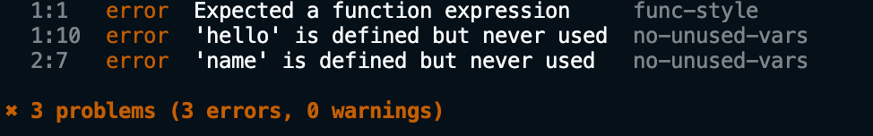

import { Message } from "theme-ui"
import Comment from "../../../src/components/comments"

#### 왜 필요한가요?
<div style={{color:'red', position: 'relative', left: -5, top: -70}}>#1</div>

자바스크립트 코드로 혼자서 소프트웨어를 개발한다고 생각해 봅시다.
개발을 한다보면 어떤 경우에는 **세미콜론**을 붙이고 또 어떤 경우에는
세미콜론을 빼먹기도 합니다. 때로는 **변수를 선언**하고 사용하지 않기도 하고
개발 시 디버깅용으로 작성한 **console.log**가 남아있기도 합니다.
코드가 어지럽고 중구난방입니다.

물론 자바스크립트는 위의 사례에 대해 관대하기 떄문에 프로그램은
잘 실행될 수 있습니다. 하지만 `불필요한 것은 없는` 혹은 `문법 규칙에 일관성이 있는`
과 같은 원칙을 가지고 있다면 앞선 예시는 모두 **문제**🤦‍♂️로 인식될 수 있습니다.

문제를 조금 더 확장🕸해 봅시다. 이번에는 혼자가 아닌 협업👨‍👩‍👧‍👧을 해야 합니다.
협업할 때 중요한 원칙 중 하나는 `여러명이 쓴 코드도 마치 한 사람이 쓴 것 처럼
보이는 것`이 매우 중요합니다. 불필요한 코드가 없는 것은 기본이요, 코딩 규칙과 스타일도
일관성이 있어야 개발과 유지 보수에 있어서 효율적이기 때문입니다.
이럴 때 자동화된 도구가 없다면 규모가 큰 코드를 살펴보고 문제를 발견하기는 매우 어렵습니다.
좋은 개발 문화가 있다면 회사만의 새로운 규칙이 재정해서 강제할 수도 있습니다.

[ESLint 공식사이트](https://eslint.org/)에 들어가보면 **"Find and fix problems in your JavaScript code"**
문장과 함께 **Find Problems**, **Fix Automatically**, **Customize** 표현을 강조합니다.
ESLint는 `문제를 찾고 자동으로 고치고, 필요하다면 새로운 규칙 추가`를 가능하게 해줍니다.


---
<br/>
<br/>


#### 사용법 살펴보기 (A-Z)
<div style={{color:'red', position: 'relative', left: -5, top: -70}}>#2</div>

개략적으로 다음 3가지 사용방식이 있습니다.

  1. 번들러와 함께 사용
  2. 코드를 통해 직접 사용
  3. cli를 통해 사용

vue, react 와 같은 프레임워크 혹은라이브러리를 사용한다면
이미 번들링 하는 과정에서 린터가 설정되어 있을 확률이 높습니다.
복잡한 빌드 과정이 요구되는 경우 코드에서 직접 `require('eslint')`
를 호출해서 구성하기도 합니다. 실제 [react 소스 코드](https://github.com/facebook/react/blob/main/scripts/eslint/index.js)를 보면 확인할 수 있습니다.
소규모 개발의 경우 cli를 통해 lint를 설정하기도 합니다.
이 튜토리얼에서는 ESlint 원리를 이해하는게 목적임으로 가장 간단한
cli를 활용한 예시 위주로 설명을 하겠습니다.

**A. 터미널을 열고 아래의 코드를 실행해 실습환경을 세팅합니다.**

```bash
# bash와 yarn을 활용합니다.
mkdir eslint-lab
cd eslint-lab
yarn init -y
yarn add -D eslint
yarn eslint --version
```

**B. 문제가 있는 코드를 작성합니다.**

뒤에서 `문제`의 종류가 무엇이 있는지 설명하겠습니다.
우선은 아래의 명령어를 통해 파일을 생성합니다.

```bash
cat<< 'EOF' > index.js
function hello() {
  let name;
  const msg = 'say hi'

  return msg
}
EOF
```

**C. ESLint를 통해 파일에 문제가 있는지 확인합니다.**

```bash
# yarn eslist는 npx eslint와 동일합니다.
# cli 기본 사용법은 다음과 같습니다.
# eslint [options] file [file.js] [dir]
# 주의!: 의도적으로 오류가 발생되는 코드입니다.
yarn eslint index.js
```

**D. 설정파일을 생성합니다.**

위의 코드를 실행하면 아래와 같은 오류 메세지를 만납니다.
ESLint 실행 시 설정파일이 필수 입니다.
오류 메세지에 있는 코드를 실행시켜 설정파일을 생성합니다.


```bash
# 설정파일 생성 코드
yarn eslint --init
```

위의 코드를 생성하면 콘솔에 일련의 질문이 뜨는데
최대한 아래와 같이 간단하게 설정합니다. (실행 버전에 따라 메세지가 다를 수 있습니다.)


**E. 문제를 확인합니다.**

다시 한번 **C.**단계를 실행하면 아래와 같이 테스트에 사용된 코드와 로그를 볼 수 있습니다.


메세지 의미를 하나씩 살펴보면, 첫 에러는 'hello' 가 정의되었지만
사용되지 않았다를 의미하고, 두 번째 에러 역시 정의만 있고 사용되지
않았음을 의미합니다.

각각의 메세지 옆에 `no-unused-vars`라는 텍스트가 있는데
eslist 기준에서 위반한 규칙(rule)의 이름입니다.
아래 **H.**에서 더 다양한 규칙을 살펴봅니다.

**F. 설정을 바꿔서 변경된 점을 확인합니다.**

생성된 `.eslintrc.js` (eslint runtime configuration) 파일을 열어서
다음과 같이 `func-style` 규칙을 추가해 봅시다. `func-style` 규칙은 함수 정의 시 [함수 표현식](https://developer.mozilla.org/ko/docs/Web/JavaScript/Reference/Operators/function)을 사용하였는지 확인합니다. 
해당 규칙을 어기면 `error`를 발생시키겠다는 의미이며 `error` 이외에도 `warning` 혹은 `off`를 설정할 수 있습니다.


설정을 변경한 뒤, 다시 한번 cli를 실행시키면 아래와 같은 결과를 확인할 수 있습니다.
샘플 코드와 관련있는 규칙을 추가해서 새로운 `규칙 어김` 사례가 생겼음을 볼 수 있습니다.
`규칙 어김` 이 곧 `error`가 되지 않습니다.
우리는 이전에 옵션에서 어떤 규칙이 위반된다면 `error` 혹은 `warning`으로 각각 다르게
정의할 수 있음을 살펴보았기 때문입니다. 그래서 `규칙 어김`(a.k.a. `문제`)를 얼마나 심각하게
생각하는지를 설정할 수 있습니다.





**G.문제를 해결합니다.**

메세지에 따라 규칙을 준수하는 코드를 작성해 봅시다. 아래 정답을 보기 전에 스스로
작성해 보시기를 바랍니다. 규칙을 준수하도록 하는 방법은 여러가지가 있을 수 있습니다.
아래의 예시는 여러 경우 중 하나로 참고하시면 됩니다.


그런데 문제를 수정할 때, 자동으로 수정을 할 수도 있습니다. [공식 문서 규칙 모음](https://eslint.org/docs/rules/)
을 보시면 🔧 아이콘이 있는 규칙은 `--fix` 옵션을 통해 자동으로 수정가능함을 알 수 있습니다.
아마 몇몇 분은 왜 모든 규칙이 자동으로 수정가능하지 않는 이유를 이해하시리라 봅니다.
세미콜론을 지우는 것처럼 해결 방식이 하나만 있다면 자동으로 할 수 있지만,
사용되지 않는 변수같은 경우 삭제하거나 혹은 사용하는 방식으로 선택지가 있기 때문입니다.


**H.어떤 종류의 문제가 있는지 살펴봅니다.**

[공식 문서](https://eslint.org/docs/rules/)에 따르면 다음과 같이 3가지 유형으로 규칙을 분류하고 있습니다.

1. Possible Problems: 코드의 논리적 오류가 있을 수 있는 규칙
2. Suggestions: 동일한 행동이지만 대체할 수 있는 방식의 규칙
3. Layout & Formatting: 코드 실행방법보다 생김새에 대한 규칙

일반적으로 공식적으로 추천하는 규칙 모음인 `"extends": "eslint:recommended"`를 사용하지만
필요에 따라 새로운 규칙을 추가하거나 기존 규칙을 변경할 수도 있습니다. 만약 린터 사용법이 더 숙달된다면
자신만의 규칙을 만들거나 규칙을 포함한 설정, 코드처리 로직 등을 플러그인 형태로 만들수도 있습니다.

현업에서는 세번째 규칙 `Layout & Formatting`의 책임을 `eslint`에만 의존하기 보다 [prettier](https://prettier.io/) 같은
formmating에 특화된 도구와 통합하여 사용합니다.


**I.나의 개발 환경에 적용합니다.**

가장 처음 `linter`가 왜 필요한지 이야기했습니다. 자신의 코드에 존재하는 문제를 자동으로 발견하고,
협업을 한다면 모두가 같은 규칙을 따르도록 하기 위해 `linter`를 사용합니다. 상황에 맞게 단계적으로 적용해 봅니다.
만약 숙달을 원한다면 작은 프로젝트를 생성해서 충분히 숙달한 뒤 큰 프로젝트에 적용하면 됩니다.


---
<br/>
<br/>


#### 마무리
<div style={{color:'red', position: 'relative', left: -5, top: -70}}>#3</div>

이 튜토리얼에서는 간단한 예시를 통해 `eslint`를 사용해보고 `linter`의 필요성과 개념에 대해 학습했습니다.
시간이 지나면 `eslint`라는 도구는 사라질 수 있습니다. 하지만 `linter` 혹은 `formatter` 같은 개념은
사라지지 않고 다른 도구가 대체하게 됩니다. 개념을 이해하고 도구를 숙달하는건 기본 중에 기본입니다.
도구가 숙달된다면 다음 단계로 넘어가세요. 내부적으로 어떻게 코드를 `추상 구문 트리(Abstract syntax tree)`로 변환하는지
`추상 구문 트리`구조는 어떻게 상호작용하는지, 내부 메커니즘을 이해하는 방향으로 학습하시면 시간이 지나도
변하지 않는 지식을 쌓아갈 수 있습니다.

> 댓글에 궁금한 점을 질문하시거나, 튜토리얼로 다뤄줬으면 하는 주제가 있으면 남겨주세요!


<Comment repo="kangthink/kangthink.github.io" theme="dark-blue"/>